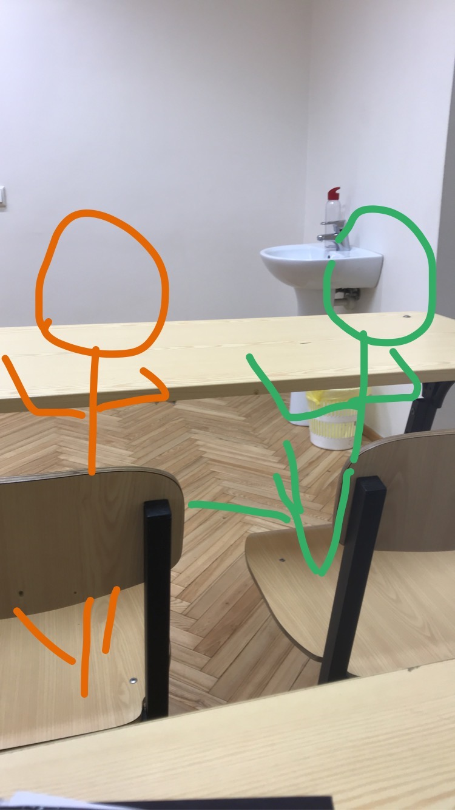

## ***Shalom! *** ##

> I am Esko Zloi and I am very zloi

### **__Languages I've Tried__** ###

### **Frameworks** ###

### **IDEs** ###

### **Databases** ###

### **Technologues** ###

### **Nüffe?** ###

<h5>Nüffe?<h5>

  
<b>✨&nbsp;&nbsp;Fun&nbsp;Facts</b>

   

> *Гришка и Гера всегда на уроке матана, как я рад* 🙂

